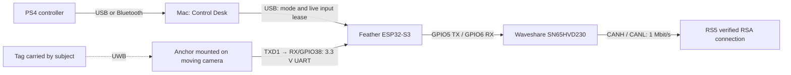

# UWB follow in RS5 Control Desk

Use the existing **rs5_manual_control** Feather application for both mouse/PS4 control and Makerfabs UWB follow. The original MaUWB_STM32 AoA kit keeps its factory anchor/tag firmware. The Feather reads the anchor's UART reports and generates DJI speed packets over the already working CAN connection. The separate `rs5_uwb_tracker` sketch remains a console-only prototype; it is not the UI firmware.

## Connection layout



| From | To | Notes |
| --- | --- | --- |
| Anchor **TXD1 / PA9**, J2 pin 4 | Feather **RX / GPIO38** | New wire; 3.3 V UART, 115200 baud, 8N1 |
| Anchor **GND**, J2 pin 2 | Feather **GND** | New shared signal ground |
| Feather **5 / GPIO5** | Waveshare **TX** | Existing connection |
| Feather **6 / GPIO6** | Waveshare **RX** | Existing connection |
| Feather **3V** | Waveshare **3.3V** | Existing breakout power |
| Feather **GND** | Waveshare **GND** and verified RS5 **GND** | Existing connection |
| Waveshare **CANH / CANL** | Verified RS5 **CANH / CANL** | Keep the proven termination and detect-resistor arrangement |

J2 numbers refer to the vendor **V1.1 schematic**, not a pin count from an arbitrary viewing angle. Identify the pads by silkscreen and confirm your board revision. Anchor TXD1 also feeds the onboard CH340 receive input; this additional receiver is connected in parallel. Leave **Feather TX/GPIO39 unconnected**. Do not connect it to anchor RXD1/PA10, which is already driven by the CH340. Power down before wiring.

Power the anchor and Feather through separate USB connections with common ground. Power the tag through USB-TTL or its supported battery. Leave their 3.3 V/5 V supply rails separate and RS5 accessory VCC insulated. For the existing RS5 contact layout, see the [main wiring table](../README.md#electrical-design).

Mount the anchor on the **moving camera platform**, aligned with the lens so it turns toward the tag as the camera pans. Keep its angle measurement plane horizontal and the camera approximately level. Rebalance the camera and provide cable clearance. This controller cannot use a fixed handle-mounted anchor without an additional coordinate transform. The original kit supplies one angular dimension, so follow changes **pan only**; pitch and roll requested speeds are zero. It does not estimate subject height or perform a 360° tag search.

## Prepare the anchor and tag

1. Connect the anchor's **USB-NATIVE** port to the computer and power the tag. Use Makerfabs **AOA System** to discover and bind **one tag**. Multiple saved tag bindings can prevent valid reports.
2. Verify the kit displays changing distance and position. Use JSON output. On the anchor's USB-NATIVE serial port at 115200 with CR+LF, `USER_CMD 0` selects JSON and `SAVE` persists it. `GETKLIST` shows bindings and the four-digit `a16` short tag ID. [Full factory setup and binding commands](../firmware/rs5_uwb_tracker/README.md#prepare-the-makerfabs-kit).
3. Connect TXD1 and GND to the Feather as above. The UI shows **Receiving tag HHHH** when framed UART measurements arrive. The ID is never automatically selected for control. Enter the short ID belonging to your tag, not its 64-bit radio address.

The receiver follows the Makerfabs `JS` + four hexadecimal length digits + JSON framing. It uses `D`, `Xcm`, `Ycm` and the ranging sequence `R`; raw phase `P` is not treated as a bearing. No STM32 source changes or ST-Link flashing are required for this path.

## Build and run

Build the combined firmware for the exact Feather profile. Keep the full repository directory layout, including `firmware/shared`:

```sh
arduino-cli compile \
  --fqbn esp32:esp32:adafruit_feather_esp32s3_nopsram \
  --warnings all \
  --build-path "$PWD/tmp/firmware-build-manual" \
  --output-dir "$PWD/tmp/firmware-manual" \
  firmware/rs5_manual_control
arduino-cli board list
```

Close the UI's serial connection before uploading, then use the **Feather's port**, not the Makerfabs port:

```sh
arduino-cli upload \
  --fqbn esp32:esp32:adafruit_feather_esp32s3_nopsram \
  --port YOUR_FEATHER_PORT \
  --input-dir "$PWD/tmp/firmware-manual" \
  firmware/rs5_manual_control
python3 control_ui/server.py
```

Open **http://127.0.0.1:8765**, choose the Feather, connect, and wait for LIVE RS5 angles. Release mouse/L1/X once after connecting. Firmware boots disarmed; neither connecting nor applying settings starts follow.

In **UWB FOLLOW**, enter your tag ID, use **5°/s**, direction **Normal (+)**, center offset **0°**, and click **Apply UWB settings**. Wait for **TAG LIVE**. Settings are acknowledged by device telemetry and cleared by a Feather reset; the browser does not silently restore or select a target. After a page reload, enter/apply the desired settings again before following. Old manual-only firmware still works for manual motion, but the UWB panel requests a firmware update.

No-hardware preview:

```sh
python3 control_ui/server.py --demo --port 8766
```

Open **http://127.0.0.1:8766**, connect to the simulated Feather, and apply tag **1234**. The PREVIEW MODE banner stays visible. The simulator never opens USB or CAN.

## Controls and first follow test

| Input | Behavior |
| --- | --- |
| **PS4 X / Cross** (standard mapping button 0) | Toggle UWB follow on/off; one action per press |
| **Start/Stop UWB follow** in the panel | Same toggle using the mouse |
| **Circle**, **Space**, **Escape** | Stop all motion |
| **L1** or mouse pad/direction control during follow | Cancel follow; release and hold again for manual motion |
| **L1 + left stick** outside follow | Existing analog manual pan/tilt; release L1 to stop |
| Changing settings, leaving the page, controller loss, connection loss | Stop; a fresh action is required to restart |

Place the tag 2–5 m in front of the lens, at approximately anchor height. Check bearing and distance before starting. With the tag slightly off center, press X briefly and then press X again to stop. The camera should turn **toward** the tag and bearing magnitude should decrease. If it turns away, stop, choose **Reverse (−)**, apply settings, and repeat. The manual-control Reverse pan setting does not change this independent follow direction. Verify both sides; the earlier observation that positive DJI yaw speed decreases reported joint yaw does not establish the sign of an installed UWB sensor.

To compensate a consistent mounting offset, put the tag at the desired lens center and enter its displayed bearing as **Center offset**, then apply. This is an angular offset, not multipath correction. Check tag power loss stops follow and bringing the tag back does not restart it; press X again after TAG LIVE. A single anchor has a limited field of view. Use manual control to reacquire a lost tag before restarting.

## Tracking behavior

The device calculates bearing as `atan2(Xcm, Ycm)`, smooths it with a 0.25 s time constant, applies a 3° deadband, and limits acceleration to 45°/s². Follow speed is independently configurable from **1–15°/s**, initially **5°/s**. Manual maximum remains **60°/s**. Valid fixes require three selected-tag reports, 0.75–20 m distance, positive forward coordinate, and bearing within ±55°. An angular jump above 25°, malformed/incomplete input, or UART overrun invalidates the fix. Duplicate/recent out-of-order ranging sequences and reports from other tags cannot refresh it. The parser/control core is shared with the console prototype in `firmware/shared`.

Tag freshness expires after **300 ms**. Follow also requires fresh browser input at about 20 Hz, a 250 ms bridge lease, the device's 300 ms input lease, and joint telemetry within 400 ms. Each heartbeat authorizes continued device-side tracking; it contains no host-computed speed. There is no generated heartbeat from cached browser intent. Timeouts are checked before buffered commands and UWB reports can revive old state. Tag loss disarms and invalidates the session; fresh tag reports alone never re-arm it. No extra joint-angle travel restrictions are added to the working manual firmware.

Normal cancellation sends zero speed then releases SDK control. CAN faults retain the existing 20 ms bounded transmit deadline, clear queued transmission, stop the CAN driver, and require a Feather reset. A physically broken control link can prevent stop packets from reaching the RS5. Keep the gimbal supported, balanced, clear of cables, and supervised during the first tracking tests. RF quality, mounting alignment, direction, and real stopping behavior require hands-on validation.

## Validation status — 2026-09-29

The combined firmware compiles with Arduino-ESP32 3.3.11 for the Adafruit Feather ESP32-S3 No PSRAM: **382,766 bytes flash, 59,688 bytes static RAM**. The standalone preview still compiles. All 30 Python tests passed. Node input and frontend-event checks and four sanitized C++ test executables passed. Automated checks cover the actual combined sketch with simulated UART/TWAI, the UWB parser and tracking core, existing manual limits/watchdogs, Python bridge and localhost WebSocket lifecycle, and the actual browser JavaScript under an event/DOM fixture. Scenarios include X edge detection, tag loss, stale/replayed leases, no automatic restart, UART errors/backlog, manual fallback, controller/focus/animation loss, and follow calibration/speed limits.

The combined build was **flashed and hash-verified on 2026-09-29**. A passive eight-second USB check captured 160 status samples and 280 incoming UWB reports from tag **`0E4C`**, with zero parsing errors and zero sampled CAN error counters. The Feather remained disarmed, at zero requested speeds, with no tag configured. No commands or CAN queries were sent during verification. Logs: `tmp/rs5-ui-uwb-flash-check.jsonl` and `tmp/rs5-ui-uwb-flash-summary.json`. The anchor/tag factory firmware was retained. **Physical following and steering direction remain untested.** Browser visual inspection was unavailable during development because the browser plugin reported no available browser. The previously verified RS5/PS4 path is retained, but these checks do not establish RF accuracy or the correct steering sign for your mount.

Sources: [Makerfabs original kit repository](https://github.com/Makerfabs/UWB-AOA-with-Display-STM32F103C8T6), locally reviewed at `34b9705edcb7feca83f652280047847d4bc03c34`. The V1.1 schematic defines TXD1/PA9 and GND; `Firmware/stm32cube/CubeIde/projectN/Core/Src/usart.c` sets 115200, `APP/Generic_cmd.c` mirrors output to UART, and `DW/PDoA/json_2pc.c` defines the measurement framing and fields. Makerfabs advertises ±60° coverage and ±5° angular error; the narrower ±55° acceptance here is a controller setting, not a measured guarantee.
