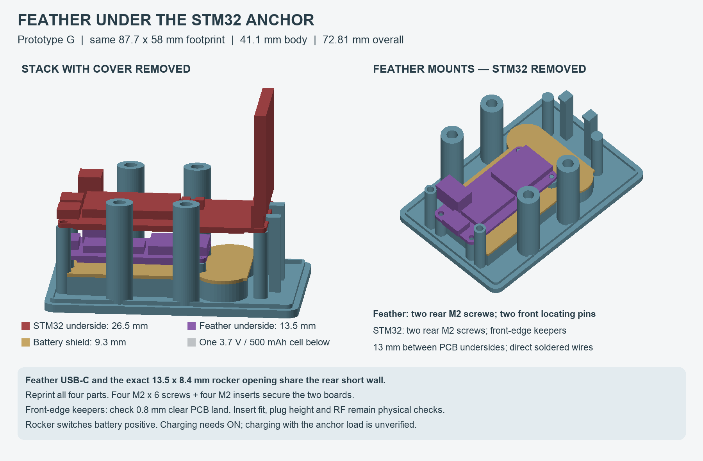
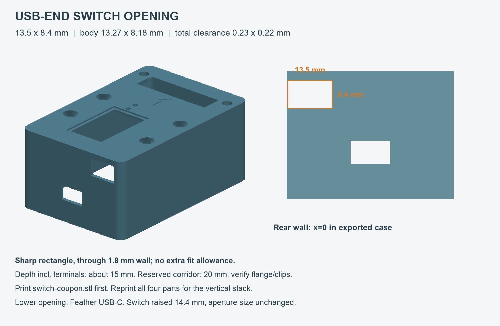

# Camera-top STM32 anchor + Feather enclosure — prototype G

The camera unit now has a **mounted Adafruit Feather ESP32-S3 below the STM32 anchor and its upright antenna**. From bottom to top: the single 3.7 V / 500 mAh battery, insulating shield, Feather, then STM32. Direct soldered wires connect the boards internally; no cable crosses a moving gimbal axis. The stationary Feather/CAN unit remains on the RS5 body.

The footprint remains **87.7 × 58 mm**. The main body is **41.1 mm high**, and total height including the antenna hood is **72.81 mm**. The two cage holes remain **26.48 mm apart**. These are CAD dimensions; physical fit and enclosed radio performance have not been validated.

## Board mounts and access

The **Feather uses two M2 × 6 mm screws at its USB end**, engaging heat-set inserts in the base, plus two front supports with **1.8 mm locating pins**. Adafruit's board CAD specifies 2.5 mm rear mounting holes and 2.2 mm front holes. The front pins avoid putting screw heads beside the ESP32 module/antenna. All four supports carry the PCB; the two rear screws retain it. Use a bare Feather with **no tall pin headers**, as confirmed by the user.

The **STM32 uses two M2 × 6 mm screws at its USB end and two front-edge keepers** built into the base. The keepers overlap the front PCB edge by **0.8 mm**, with **0.2 mm vertical clearance**, and remain below the upright antenna. The two front mounting holes rest on plain supports. No screws or lid pillars occupy those covered holes. To remove the STM32, unplug the relevant leads, remove its two rear screws, slide the board **1.5 mm toward USB**, then lift it with its antenna attached. Check that the delivered PCB has clear land at x=71.2…72 mm, y=8…12 and 22…26 mm; the modeled header ends at x=71 mm and remains provisional.

The Feather underside is at **z=13.5 mm** and the STM32 underside at **z=26.5 mm**: **13 mm between boards**. The provisional 8 mm-high mated Feather battery plug clears the modeled STM32 underside components by **1.4 mm**. Feather solder joints have **1 mm clearance above the shield**. These clearances assume short direct wires, no header sockets, 1.6 mm PCBs and the documented component envelopes.

A separate **12 × 7 mm USB-C access opening** exposes the Feather charger in the rear short wall. The connector face is approximately **2.56 mm behind the outer wall**, based on the vendor footprint. The opening is a trial cable-body allowance; check the actual plug and connector height. Both stock STM32 USB ports stay covered.

## Exact rocker opening and charging

The same rear short wall has the requested **13.5 mm wide × 8.4 mm high rectangular opening** for the measured **13.27 × 8.18 mm KCD11-101 style switch body**. Total clearance is exactly **0.23 × 0.22 mm**. There is **no added fit allowance, corner radius or chamfer**. The wall is x=0 in the exported case and x=-3.7 mm in the source assembly.

Its center is now **y=-2 mm, z=34.1 mm**. Raising it **14.4 mm from revision F** clears the higher STM32 and its screw heads, including vertical lid removal. The approximately **15 mm installed depth**, including terminals, has a **20 mm reserved corridor** with the measured body cross section. This corridor does not enlarge the opening. Flange, clips, terminal spread and bent leads remain unmeasured. The plastic above the opening is **2.8 mm** to the outer roof.

Print [switch-coupon.stl](switch-coupon.stl) to check the exact aperture in a 1.8 mm wall. The lower opening visible in the preview is for the Feather USB-C charger.

The rocker now sits **in the battery's positive lead, before the camera Feather's JST**. Feather BAT/GND then feeds the STM32 battery socket. Leave Feather EN externally unconnected. **Closed contacts = ON; open contacts = battery OFF.** No electronic load-switch board is required. See the [power circuit and servicing instructions](../../firmware/WIRELESS_UWB.md#camera-side-power-direct-battery-switch).

**Charging through Feather USB-C requires the rocker ON.** The STM32 remains a load on BAT, so net charging current and proper charge termination still require measurement. OFF disconnects the cell from charging but does not isolate USB power. For an initial unloaded charging check, disconnect the anchor BAT pigtail and UART as described in the power guide. Keep the anchor USB ports disconnected. Unplug USB and the battery before internal service.

The same 13.5 × 8.4 mm switch opening, 20 mm reserved corridor and board mounts apply. Check the actual battery-current harness, terminal insulation and lead slack against the case; flexible wires are not represented by the component-envelope checks.

## Files

- [Editable OpenSCAD model](enclosure.scad): assembly by default; `part="exploded"` separates the layers.
- [Complete four-part print plate](print-plate.stl): **91.2 × 190 mm**, units mm, scale 100%.
- [Base](base.stl), [cover](cover.stl), [hood](hood.stl), [shield](shield.stl). **Reprint all four for revision G**; the hood height changes with the taller roof.
- [M2 board-insert coupon](board-insert-coupon.stl): 2.8 / 2.9 / 3.0 / 3.1 / 3.2 mm trial bores, ordered along the 48 mm length.
- [M3 insert coupon](insert-coupon.stl): 4.4 / 4.5 / 4.6 / 4.7 / 4.8 mm bores along the 65 mm length.
- [Switch fit coupon](switch-coupon.stl), [STM32 outline/hole gauge](fit-gauge.stl), [cage mounting gauge](mount-gauge.stl). Gauges/coupons are separate from the plate.
- [Measurements and provenance](measurements.json), [mesh/interference report](mesh-checks.json), [assembly preview](preview.png).
- [Build/check script](../../tools/build_anchor_enclosure.py): run `python3 tools/build_anchor_enclosure.py` from the repository root.

## Hardware

| Quantity | Hardware |
| --- | --- |
| 4 | M2 × 6 mm pan-head screws: two per board; modeled head up to 4 mm diameter × 1.6 mm high |
| 4 | M2 heat-set inserts, 3 mm long, approximately 3.2 mm outside diameter; validate with coupon |
| 6 | M3 × 4 × 5 mm heat-set inserts: four in base, two in cover for hood |
| 4 | Existing M3 × 8 mm 90° countersunk lid screws, inserted from above |
| 2 | M3 × 8 mm pan/button-head hood screws |
| 2 | Existing screws matching the camera cage threads, with suitable engagement length |
| As needed | Thin battery pad, insulated direct wires, optional 0.5 mm PET display window |

M2 pockets are a **3.0 mm trial diameter**, **3.8 mm deep**, with a **2.2 mm core continuing another 1 mm**. The M2 screw tip clears the core bottom by 0.4 mm with the assumed 1.6 mm PCB. The 5 mm-diameter posts support the board around its holes. Verify the selected inserts and screw heads before printing the full base; insert dimensions vary.

Use a precision screwdriver with a shaft no wider than the modeled **4 mm** for the board screws. Remove the STM32 before accessing the Feather screws. The lid screws use a separate 8 mm shaft clearance check.

M3 insert pockets retain the **4.6 mm trial diameter** and **5 mm depth**, with a 3.4 mm screw core continuing 1.2 mm. Base closure posts are 9.4 mm in diameter and end at **z=38.1 mm**, 0.2 mm below the lid seats. Screw centers are **(22,-6.2), (45,-6.2), (22,38), (45,38) mm**. Four M3 × 8 countersunk screws engage the full 4 mm insert length. No underside access is needed to open the case.

## Camera mounting and alignment

Mount on the **moving camera or cage**, with +X toward the lens, Y across the camera, and +Z upward. Do not use the stationary handle-side CAN adapter mount for the anchor: it would not preserve the camera-to-anchor orientation needed by this controller. The recessed arrow points toward the lens. The two antenna elements must remain **side by side and level**, with their broad face looking forward.

The cage holes are **(57,3.06) and (57,29.54) mm** in assembly coordinates. They have **6.8 mm smooth bores**, **10.2 mm head recesses**, and **2.4 mm flat seats** above the cage-facing underside. These fit the user's approximate **6.23 mm shaft / 9.38 mm head diameter / 6.23 mm head height** envelope. The shield remains at z=9.3 mm, giving **0.67 mm head clearance**. The gauge checks these seats and hole spacing, not the strength of the loaded assembly.

For a flat-under-head cage screw without a washer, protrusion below the case equals under-head length minus **2.4 mm**. Check cage thread depth and engagement; the thread designation remains unknown. The cage must support the base around both holes. Do not use screw force to pull an uneven case flat. The screw heads are beneath the shield and electronics, so fasten the empty base first.

The radio front face stays flush with the 72 mm carrier edge: the approximate 4 mm-thick module occupies x=68…72 mm. Its top is user-measured **42.11 mm above the STM32 underside**. The hood leaves nominal **3 mm air clearance**, with **1.2 mm plain-plastic walls**. The header envelope is provisional; verify it and the new keepers against the actual board.

The Feather antenna is below the STM32 board in this layout. **Mechanical clearance is not an RF keep-out validation.** Check ESP-NOW reception over full gimbal travel and compare bare/enclosed UWB bearing before relying on the stack. Keep the UWB antenna pair above cage metal. Check zero bearing with the tag centered in the lens, then verify left/right sign. Rebalance for the taller enclosure and confirm clearance through the entire gimbal movement. Alignment to the cage-hole midpoint does not prove alignment to the lens; that offset has not been measured. The current one-angle controller still assumes an approximately level camera.

## Printing and assembly

Use plain unfilled PETG for the working parts; avoid conductive/carbon/metal fillers around the antennas. Start with a 0.4 mm nozzle, 0.2 mm layers and four perimeters. Print the shield solid. Base prints flat, cover roof-down, hood open-end-down and shield flat. Inspect the approximately **1.1 mm front-keeper overhangs**, hood roof bridge, countersinks and window recess in the slicer. These orientations are not printer-tested; the enclosure is not weather-sealed.

1. Check cage fit with the mounting gauge if not already verified. Print the M2/M3 insert and switch coupons before the full set. Check the actual Feather board revision, mounting holes and USB plug against the source dimensions.
2. Print all four revision-G parts. Trial-fit them empty. Install four M2 inserts in the two Feather and two STM32 rear posts; install four M3 inserts in the lid posts and two in the cover's hood mounts. Let them cool with electronics removed.
3. Fasten the empty base to the cage. Add the thin pad and battery without compressing the pouch. Route its lead through the cradle/shield notch. Lower the shield over all posts; its new openings clear the Feather supports. Check both cage heads remain below it.
4. Lower the Feather onto its four supports with USB toward the rear opening. Engage its two front locating pins and install the two rear M2 screws. The board must sit flat. Fit the switched battery harness with the cell unplugged, then connect Feather BAT/GND to the anchor battery pigtail and route the UART lead before the STM32 blocks access.
5. Hold the STM32 level, slightly rearward, with its front edge beneath the two keepers. Slide it forward 1.5 mm to align the rear holes, then install its two M2 screws. Check the keepers overlap only clear PCB edge and touch neither header nor antenna. No fasteners enter the covered front holes. Keep wire slack clear of the Feather antenna and solder joints.
6. Fit the rocker in series with the battery harness positive lead; keep the negative lead continuous and leave Feather EN unconnected. Insulate both terminals, which now carry battery current. Leave enough flexible lead to support and unplug the cover. Check the approximate 15 mm installed depth, flange and clips physically. No loose lead may cross a screw boss or press on the battery.
7. Lower the cover vertically around the antenna. Close its four M3 screws from above without forcing the joint. Fit the hood with its two M3 screws. Check USB plug reach and switch action. An optional 0.5 mm PET window can be bonded into the OLED recess.
8. Verify power-off/charging behavior, wireless link loss handling, alignment and balance before tracking.

For service, remove the four lid screws and lift the cover/hood vertically while supporting the switch lead. Unplug all USB cables and the battery; the battery-side rocker terminal stays live when OFF. Release the two STM32 screws, slide the board rearward **1.5 mm**, then lift it, supporting or unplugging its leads. Its antenna can remain installed within the modeled envelopes. Remove the two Feather screws and lift it vertically off the front pins. The shield and battery can then be removed while the base stays on the cage. Remove both boards and shield to reach the cage screws.

## Evidence and validation limits

- [Adafruit Feather ESP32-S3 PCB CAD](https://github.com/adafruit/Adafruit-Feather-ESP32-S3-PCB/blob/main/Adafruit%20ESP32-S3%208MB%20No%20PSRAM.brd): **50.8 × 22.86 mm outline**, 2.54 mm corner radii, rear hole centers (2.54,2.54)/(2.54,20.32), front centers (48.26,1.8415)/(48.26,20.955); USB/JST/module XY footprints. Read 2026-10-04; downloaded-file SHA-256 recorded in measurements. Component heights are provisional.
- [Pinned Makerfabs carrier CAD](https://github.com/Makerfabs/UWB-AOA-with-Display-STM32F103C8T6/tree/34b9705edcb7feca83f652280047847d4bc03c34/Hardware): **72 × 32.6 mm PCB**, 3 mm holes at (2,2), (2,30.6), (70,2), (70,30.6), display and connector XY. Compare against the delivered revision. Its flat tag footprint is not used for the anchor's upright radio envelope.
- [X3 module manual](https://github.com/Makerfabs/UWB-AOA-with-Display-STM32F103C8T6/tree/34b9705edcb7feca83f652280047847d4bc03c34/Doc): 33 × 36 × 3.5 mm module listing; user supplied 33 mm width, approximate 4 mm lower depth, flush-front position and 42.11 mm installed height.
- Battery packed dimensions **35.5 × 29 × 4.65 mm** are user measured. The cradle adds 1 mm per side, with a 0.3 mm pad and 1.85 mm total vertical allowance under the shield. [PKCELL LP503035 specification](https://www.batterypkcell.com/uploads/LP503035-500mAh-3.7V.pdf) identifies the electrical cell limits; protection and connector polarity still require confirmation.

The build verifies closed printable meshes, expected component counts, positive volume and agreement between the plate and individual parts within 0.002 mm export rounding. Mesh probes inspect cage holes/seats, lid countersinks, blind base floors, board insert openings, Feather locating pins, STM32 keepers and both faces of the new USB aperture. The rocker check inspects exact corners and ±0.01 mm around every edge on both wall faces, without adding tolerance to its geometry.

OpenSCAD checks printed-part, component and fastener interference, including the Feather and four M2 board screws. Separate checks cover the 20 mm switch corridor, trial USB plug corridor, lid-driver access, sampled lid removal, continuous vertical radio/header sweep, and sampled STM32 slide/lift and Feather lift paths. Mating faces may yield numerical zero-volume intersections. Board service paths are sampled, not a full swept scan. Actual flange/clips/terminals, flexible wiring, insert knurls, camera/cage surfaces and manufacturing variation are excluded. Passing checks does not establish real retention strength, print fit, RF performance, thermal performance, balance, charging compatibility or runtime.
