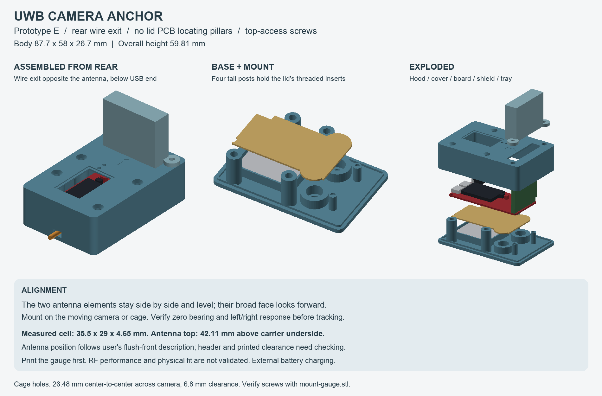
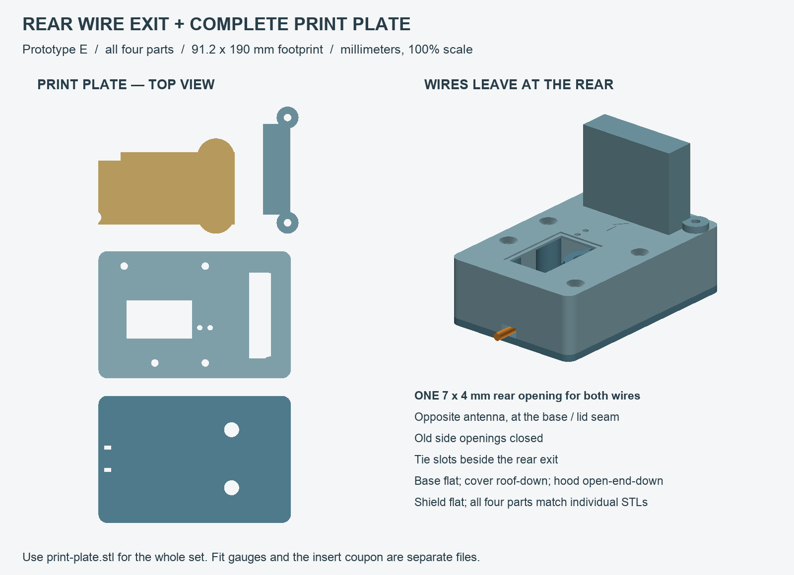
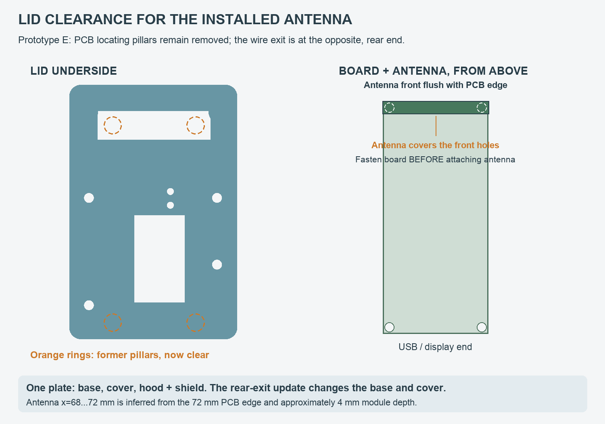
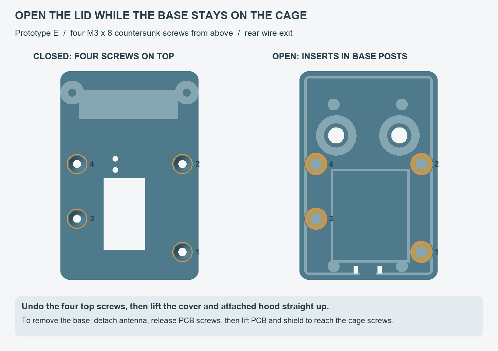
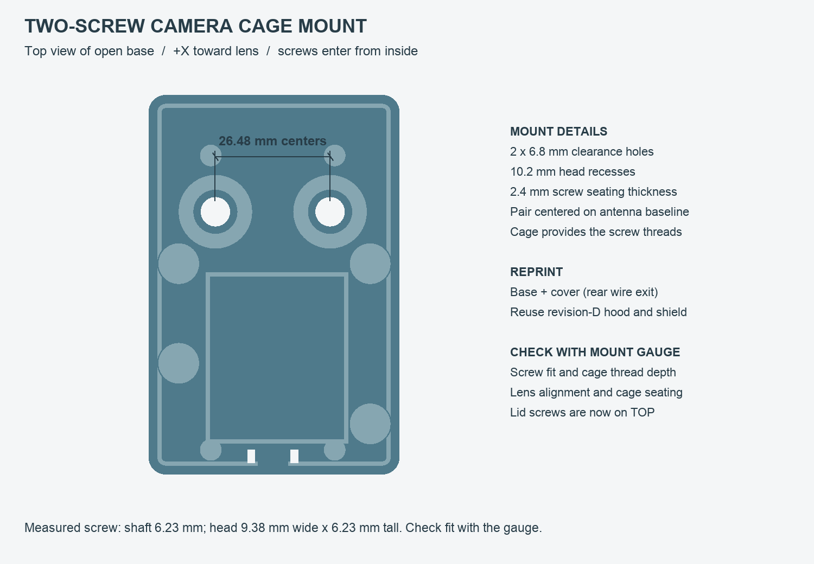

# Camera-top Makerfabs UWB anchor case

**Prototype E: rear wire exit and complete four-part print plate. Physical fit of this revision and RF performance have not been verified.** This is for the original Makerfabs STM32 AoA anchor in your overhead photo, with an upright dual-antenna module and PKCELL LP503035 3.7 V / 500 mAh battery. It is separate from the existing tag enclosure. Both signal wires now leave through one opening at the rear, opposite the antenna. This retains the two-hole cage mount and top-access lid screws. The user found that the antenna covers the front PCB mounting holes, so revision C's descending lid pillars struck it. This lid has no PCB locating pillars or pins. **PCB retention is incomplete: the base supports have only 3.1 mm-diameter, 1.2 mm-deep locating recesses, not screw mounts. A mistaken assumption that separate board fastening already existed must be corrected in the base and print plate before this is ready for assembly.**

The case mounts directly on the **moving camera's cage**, with the antenna end toward the lens. Two screws pass down through the base into the cage's existing threads, **26.48 mm center-to-center, left-to-right**. The pair is centered on the antenna module at y=16.3 mm. The central hole, nut pocket and nut boss are removed. The body remains **87.7 × 58 × 26.7 mm**; overall height is **59.81 mm**. Battery size and installed antenna height use your measurements. The antenna front face now aligns with the 72 mm PCB front edge per your description; its rear face at x=68 mm is inferred from the approximate 4 mm module depth. The header envelope remains provisional.

**[print-plate.stl](print-plate.stl) contains the current four parts, but still needs the PCB mounting correction described above.** It contains the base, cover, hood and shield in their print orientations, with a **91.2 × 190 mm footprint** before brim/skirt. Import in millimeters at **100% scale**. Gauges and the insert coupon are separate.

Compared with revision D, the **base and cover** change: the old side wire openings and tie slots are closed, and a single **7 × 4 mm rear seam opening** serves both wires. The tie slots move next to it. The revision-D hood and existing shield can be reused if you prefer to print only the changed parts. All four PCB locating pillars remain removed; the antenna opening, cage mount and top-access screw pattern are unchanged.

Do not substitute the handle-side RSA/NATO mounting point used by the CAN adapter. That location does not maintain the camera-to-anchor orientation required by the current pan controller. Using it would require a different tracking coordinate transform. A bracket attached to the actual moving camera platform can work, provided it clears the gimbal through its travel.

## Files

- [Editable OpenSCAD model](enclosure.scad): opens as an assembly; select `part="exploded"` to inspect the stack.
- [Fit gauge](fit-gauge.stl): first print, 1.2 mm thick; checks carrier footprint and four mounting-hole centers.
- [Cage mounting gauge](mount-gauge.stl): open frame with the case footprint and both cage holes. Its 2.4 mm screw seats and 9.3 mm-tall head collars match the base. For fit checking only, not supporting the loaded case. The revision-B gauge still checks the same cage pattern; its old lid-hole markers can be ignored.
- [Base tray](base.stl), [display cover](cover.stl), [antenna hood](hood.stl), [battery shield](shield.stl).
- [Four-part print plate](print-plate.stl): current base, cover, hood and shield; 91.2 × 190 mm footprint, print orientations already applied, units millimeters, scale 100%. [Plate/rear-exit preview](print-plate-preview.png).
- [M3 insert coupon](insert-coupon.stl): five holes, 4.4 / 4.5 / 4.6 / 4.7 / 4.8 mm, ordered along the 65 mm length.
- [Dimension provenance and assumptions](measurements.json), [mesh and interference checks](mesh-checks.json), [preview](preview.png).
- [Rebuild/check script](../../tools/build_anchor_enclosure.py): `python3 tools/build_anchor_enclosure.py` from the repository root.

## Layout and alignment

The carrier lies flat, display upward. The battery sits below the display end in a noncompressing pocket. A separate 1.2 mm shield separates the pouch and cage screw heads from solder joints. The tray still supports the carrier at its four mounting holes. **There is currently no completed PCB fastening method.** The lid no longer locates or clamps the PCB, and the base retains the old shallow locating sockets. No screw size is specified for those sockets; the M3 hardware below belongs to the lid and hood. Four M3 screws close the body from above, engaging inserts in the base. The separately removable antenna hood uses two M3 screws, both below the antenna elements.

In the source coordinate system, **+X points toward the lens**, Y is camera left/right, and +Z is up. The antenna's broad board face is perpendicular to the lens axis; the two antenna elements must be **side by side at the same height**, rather than one above the other. The upright PCB alone does not establish correct orientation: verify the actual element positions and sensing face. The recessed arrow on the cover is the intended forward direction.

The hood has nominal **3 mm air clearance** around the module and 1.2 mm plain-plastic walls. It protects the module without pressing on its antenna faces. It does not clamp or straighten a loose header; the module must already be seated squarely. The battery ends at x=41 mm, away from the antenna envelope at x=68…72 mm. These are mechanical layout choices, not a manufacturer-specified RF keep-out or a claim that the radome is RF neutral.

Use plain unfilled PETG for working parts, with no conductive/carbon/metal filler. Before enabling follow, compare the bare and enclosed anchor: put the tag centered in the lens view, check near-zero bearing, then move it left/right and verify the expected sign. Seat both cage screws, check the forward arrow against the lens, then tighten evenly. Apply any small residual zero offset through the existing calibration workflow. Check again after remounting. Centering the antenna over the hole pair aligns it with the lens only if that pair is itself centered on the lens; this has not been measured. Keep the antenna pair above camera/cage metal and rebalance the gimbal with the case and cables installed. The one-angle tracking controller assumes an approximately level camera; this enclosure does not add tilt tracking.

## Measurements still needed before the full print

The photo is useful for identifying parts and routing, but perspective cannot supply reliable Z dimensions. All defaults are editable. The current design uses:

| Feature | Current CAD value | Basis / check |
| --- | --- | --- |
| Carrier PCB | 72 × 32.6 mm | Vendor V1.1 Eagle outline; compare against the delivered anchor revision |
| Four 3 mm mounting holes | (2,2), (2,30.6), (70,2), (70,30.6) mm | Vendor carrier CAD |
| Radio module | 33 wide × 36 tall × 4 deep mm | User width and approximate lower thickness; 36 mm module height from manual |
| Radio front / rear face | x=72 / 68 mm from the USB-end PCB edge | Front flush with PCB per user; rear inferred from approximate 4 mm depth |
| Installed radio top | 42.11 mm above carrier underside | **User measured**; derived module bottom is 6.11 mm above carrier underside |
| Header body | x=66.8…71 mm, y=0.3…32.3 mm, 8 mm high | **Provisional** relative placement, shifted with module; measure independently |
| Battery | 35.5 × 29 × 4.65 mm | **User measured**; cavity adds clearance around this envelope |
| Battery clearances | 1 mm each side; 1.85 mm vertical allowance | Includes a 0.3 mm bottom pad; original 6.5 mm deck height retained for body height and hood/shield compatibility; do not compress the pouch |
| Cage hole spacing | 26.48 mm center-to-center along Y | User measured and confirmed left-to-right |
| Cage opening | Approximately 5.16 mm | User measured; does not identify thread or screw shaft diameter |
| Fitting screw | Approximately 6.23 mm shaft; 9.38 mm head diameter × 6.23 mm high | User measured an existing screw that fits the cage |
| Printed mounting holes | 6.8 mm smooth clearance | Adds 0.57 mm diametral clearance to the measured shaft |
| Screw-head recesses | 10.2 mm diameter × 6.9 mm deep | 2.4 mm floor beneath each head; 0.67 mm clearance to shield above the measured head |
| Lid closure | Four top-access M3 × 8 countersunk screws | 9.4 mm base posts; 4.6 mm trial insert bores; 2.8 mm lid seats |
| PCB thickness / underside / top space | 1.6 / 3 / 10 mm | Provisional; top includes plugged battery connector and relaxed lead bend |

Trial-fit the new cover and hood against the assembled antenna before installing the hood inserts. The CAD interprets “flush with the front of the board” as the antenna's outer face lying at x=72 mm; its approximately 4 mm-deep body occupies x=68…72 mm. Confirm that interpretation and whether the widest section is centered across the carrier. The opening provides x=65…75 mm clearance around that envelope. Use the measured cell envelope including tape/protection, and verify connector reach with the slack stored in the USB/BAT-end side channel. Do not fold the cell or put the lead under a screw boss. The model contains parameter guards; a significantly different antenna position can require changing the hood/opening geometry, not merely moving a reference object. Do not scale the whole STL.

Also check the cage contact surface, lens clearance, camera controls, and the gimbal's complete swept clearance. The two cage-hole centers are **(57, 3.06) and (57, 29.54) mm** in the source coordinates. `mount_x` and `mount_y` move the pair together; `mount_pitch` sets their separation. These coordinates keep both heads outside the battery pocket. A different placement requires rerunning the collision checks.

The cage screws are beneath the shield and PCB, so fit them **before installing the electronics**. The lid then lowers onto the mounted base and fastens entirely from above. Its screw centers are **(8,-6.2), (45,-6.2), (22,38) and (45,38) mm**. The asymmetric positive-Y rear post clears the tall battery connector. No lid screw, insert or driver needs access from beneath the cage. The CAD checks an 8 mm straight driver shaft above each lid screw, samples vertical removal with the hood attached, and continuously sweeps the rectangular antenna/header envelopes through the lid over 60 mm of vertical travel. The actual cage/accessories and loose cable routing still need a physical fit check.

## Hardware and printing

| Quantity | Hardware |
| --- | --- |
| 6 | M3 × 4 × 5 mm heat-set inserts: four in the new base, two in the new cover's hood mounts |
| 4 | Existing M3 × 8 mm 90-degree countersunk screws, now inserted from the TOP of the cover |
| 2 | M3 × 8 mm button/pan-head screws, for the hood |
| 2 | Existing screws matching the cage threads, with measured shaft/head dimensions and suitable length |
| Unresolved | PCB mounting hardware: current supports are not screw mounts; base redesign required |
| As needed | Thin soft pad, small cable ties, optional 0.5 mm clear PET for the display window |

The insert pockets are a **4.6 mm trial diameter**, 5 mm deep, with smaller clearance bores continuing beyond them for the screw tips. The four base posts are 9.4 mm in diameter and end at z=23.7 mm, 0.2 mm beneath the thickened lid seats. The hood mounts retain their 10 mm bosses. With the modeled 8 mm lid screws, the full 4 mm insert length is engaged and the screw tip has 1.2 mm clearance to the bottom of the core bore. Test the coupon in the intended filament; it is not a supplier-guaranteed fit. Install inserts with electronics removed. The cage mount has smooth through-holes and flat screw-head seats; the threads are in the metal cage. No nut or shoe adapter is used. Hardware is not included in the STL.

The mount uses your measured **6.23 mm shaft** and **9.38 mm diameter × 6.23 mm-high head**. The 6.8 mm bore adds 0.57 mm diametral clearance; the 10.2 mm recess adds 0.82 mm around the head diameter. Each flat head seat is recessed 0.4 mm into the 2.8 mm floor, leaving **2.4 mm of plastic beneath the head**. The head sits completely inside its collar, with **0.67 mm clearance below the shield**. The cage-facing underside stays flat. Test these printed clearances with your screw using the mounting gauge; the measurements are approximate. These seats require flat-bottomed heads. No washer allowance is included in the measured screw envelope.

The screw seat is **2.4 mm above the cage contact face**. For a flat-under-head screw without a washer, protrusion into the cage equals its under-head length minus 2.4 mm. Measure available cage depth and check thread engagement; do not let the screw bottom out or contact the camera. The base needs a flat supporting cage surface around both holes. Tighten only enough to seat it without deforming the printed floor.

Start with a 0.4 mm nozzle, 0.2 mm layers and four perimeters. Print the shield solid. Base prints flat; cover prints roof-down; hood prints open-end-down, with a 10 mm roof bridge. Inspect the slicer for the hood bridge, countersinks and display-lens recess. A brim may help the tall narrow hood. These orientations are intended to avoid supports, but are not printer-tested. PLA is suitable for the initial gauge. The enclosure is not sealed against weather.

## Assembly and battery access

**This sequence remains provisional until PCB mounts are designed and checked. The current print plate does not complete board retention.**

1. If cage fit is not already checked, print the cage mounting gauge and check both cage screws, contact face and lens alignment. The separate carrier fit gauge checks the unpowered PCB footprint/hole pattern. Neither gauge validates module offset, height or battery fit.
2. Print the full revision-E plate, or just its **base and cover** if reusing the revision-D hood and shield. Trial-fit the parts empty. Install **four inserts downward into the new base posts** and **two into the cover's hood mounts**, with electronics removed, and let them cool fully. Prethread a small cable tie through the two rear slots before mounting the base; its band goes in the 1 mm-deep underside recess and its locking head stays inside the case.
3. Fasten the empty tray to the cage with both screw heads inside their recesses. Fit the thin pad and battery without compression; route its lead through the shield/cradle notch toward BAT. Fit the revised shield over the cradle and both mounting bosses. Check that it sits flat without contacting either screw head.
4. **Assembly is incomplete at PCB attachment.** The four supports carry the board but cannot secure it with the specified hardware. Revise the mounts and validate PCB fasteners and antenna clearance before proceeding. The antenna covers the front PCB holes when installed, so the final fastening method must account for that access restriction.
5. Route both signal wires around the battery/PCB to the **rear (USB/display end, opposite the antenna)**. Pass them together through the **single 7 × 4 mm opening** at the base seam. Secure the insulated bundle or sleeve with the prethreaded rear tie, leaving slack at the solder joints. Check the tie band sits entirely inside the underside recess so the base can seat flat on the cage. Keep wires off the battery pouch, away from screws and out of the rest of the lid joint; leave a relaxed service loop to the gimbal.
6. Lower the cover vertically around the installed antenna. There are **no PCB pillars or pegs projecting from this lid**. Close with four M3 × 8 countersunk screws from **above**, through the lid into the base inserts. The case faces must meet without using screw force to correct fit.
7. Lower the hood over the module and fasten its two M3 × 8 pan/button-head screws. Verify there is no contact with the antenna faces. An optional PET window can be bonded in the shallow OLED recess; the opening is otherwise exposed.
8. Check alignment, rebalance, then check cable clearance and bearing response before tracking.

For battery removal, keep the camera stable and upright and remove the four lid screws from **above** while supporting the cover. The base stays fastened to the cage. Lift the cover and attached hood vertically without snagging the upright radio. **The current model does not secure the PCB; support it while the lid is removed.** Unplug BAT by its housing. If access requires lifting the PCB, detach the antenna as needed to reach the covered front mounting screws, release the PCB fasteners and support the board; move it only as far as the tied signal leads allow. Lift the shield and remove the cell. To remove the base from the cage, first clear the PCB and shield to expose the two cage screw heads. There is no added power switch in this version.

The default cover blocks both USB ports because the carrier's source schematic uses a TP4056 with a 1.2 kOhm programming resistor (about 1 A), while the PKCELL cell specification gives a **500 mA maximum charge current**. Charge the pack externally with a compatible 1S charger; do not connect USB while this battery is plugged into an unmodified board. For bench USB access, disconnect/remove the battery and open the case. This carries forward the documented carrier charging limitation, rather than assuming the actual board has been modified. Verify BAT/pack polarity independently; matching plugs do not prove it.

## Evidence and validation limits

- [Makerfabs original STM32 AoA kit](https://www.makerfabs.com/mauwb-stm32-aoa-development-kit.html): anchor/tag identification and original hardware.
- [Pinned Makerfabs hardware repository](https://github.com/Makerfabs/UWB-AOA-with-Display-STM32F103C8T6/tree/34b9705edcb7feca83f652280047847d4bc03c34/Hardware): V1.1 carrier outline, mounting holes, display, connectors and charge circuit. Its U2 library footprint describes a flat tag module, so **it is not used as the anchor's installed 3D envelope**.
- [X3 module manual, page 3](https://github.com/Makerfabs/UWB-AOA-with-Display-STM32F103C8T6/tree/34b9705edcb7feca83f652280047847d4bc03c34/Doc): X3-AOA (CA) 33 × 36 × 3.5 mm listing and images of the dual element layout.
- [PKCELL LP503035 specification](https://www.batterypkcell.com/uploads/LP503035-500mAh-3.7V.pdf): cell identity and charging limit.

The build checks each printable STL for finite triangles, two faces per edge, expected connected-component count and positive volume. It verifies that the four parts on the print plate match the current individual exports (within 0.002 mm export rounding tolerance), rather than merely counting four components. Mesh probes check the rear opening, closed former side openings, relocated tie slots and remaining floor above the tie recess. A 3 mm trial wire-bundle envelope is checked through the rear wall and base lip; actual wire size and loose internal routing are not modeled. OpenSCAD intersections check the printed parts against one another and against simplified component envelopes; the vertically separated base/hood pair is checked by its bounds. Separate intersections check the six M3 screws and two measured cage screw envelopes against both plastic and electronics. Mesh probes verify the cage openings, closed former center hole, four top-facing lid countersinks, and closed base floor at both old and new closure positions. A separate intersection checks a 2.5 mm driver bit at each screw head and an 8 mm driver shaft for 70 mm above the lid. Lid/hood removal is checked at upward offsets of 0.2, 1.6, 10, 30 and 60 mm against the base, shield and electronics. Those checks use sampled positions. An additional exact vertical sweep of the **rectangular radio and header envelopes** covers the full 60 mm insertion/removal travel through the lid and hood. Exported mesh bounds also confirm that all four former PCB pillar/pin volumes are empty below the lid roof. Heat-set insert knurls are excluded because their interference with softened plastic is intentional. PCB fasteners are absent from the design and checks: passing mesh/interference checks does not validate PCB retention. These checks do not establish actual screw fit, cage contact or physical tool access, structural strength, gimbal balance, antenna calibration, RF transparency, waterproofing, charge compatibility or battery runtime. The radio position follows the user's flush-front description and approximate thickness, rather than a new caliper offset. Header shape and other unmeasured component clearances remain provisional; PCB mounting still needs to be designed.
