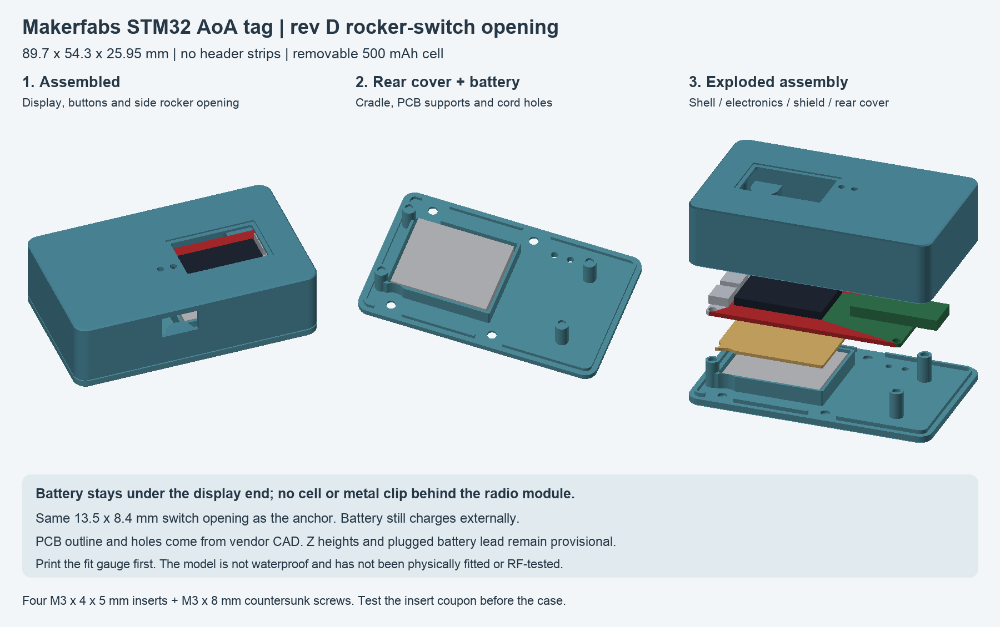

# Pocket case for the Makerfabs STM32 AoA tag

Prototype rev D (M3 heat-set inserts and rocker opening) for the **original MaUWB STM32 AoA kit's TAG**, with its display and **no expansion header strips fitted**. The anchor has a different radio shape and does not fit this case.

User choices: smallest practical case, roughly **1–2 hours** of use, a **removable battery charged externally**, and no modification to the tag's PCB. The runtime target still needs a current measurement and a discharge test.



## Proposed specification

| Item | Rev D specification |
| --- | --- |
| Outside dimensions | **89.7 × 54.3 × 25.95 mm**, including all three printed parts; height is provisional |
| Carrier PCB | 72 × 32.6 mm, with 1.5 mm corner radius, from vendor V1.1 CAD |
| Four PCB holes | Ø3 mm; 68 × 28.6 mm center spacing, 2 mm from nominal board edges |
| Tag radio allowance | Vendor footprint spans x=50–82 mm, including a 10 mm overhang beyond the carrier; confirm actual X3-MAX module |
| Battery | Protected **1S LiPo, 3.7 V nominal / 4.2 V full, 500 mAh** |
| Cell design envelope | **36 × 29 × 4.75 mm**, excluding the loose plug and lead |
| Battery space | 1 mm clearance on each side and 1 mm total vertical allowance, including any pad/pull tab |
| Construction | Rounded front shell, removable rear cover, separate 1.2 mm rigid battery shield |
| PCB retention | Four locating pegs and opposing corner supports; no screws through the PCB |
| Closure | Four **M3 × 8 mm countersunk screws**, 90° heads up to 6.72 mm, into four **JROUTH M3 × 4 × 5 mm heat-set inserts** |
| Insert pockets | **4.6 mm trial diameter × 5 mm deep** in 10 mm bosses; test the coupon before the case |
| Access | Recessed screen window and small recessed button holes; optional clear PET screen cover |
| Rocker switch opening | **13.5 × 8.4 mm**, exactly the same aperture as the camera anchor, on the BAT-connector long side |
| Charging | Battery removed and connected to an external charger; default case covers both tag USB ports |
| Carrying | Pocket-size body plus two holes for soft cord / attachment to a garment clip |
| Material | Plain, unfilled PETG suggested; no metal coating or carbon/metal-filled filament |
| Environmental rating | None: open button/cord holes and an optional glued screen film are not a weather seal |

This is about the size of a thick remote, suitable for checking against your actual pocket. It is not a tiny tracker module. The development board, display, radio overhang and mated battery plug determine the minimum size. After measuring the assembled tag, `top_clearance` may be reducible from the current conservative 10 mm.

## Files and first print

- [OpenSCAD source](enclosure.scad): all dimensions and clearances are editable; `part="print_plate"` is the default.
- [Fit gauge](fit-gauge.stl): print this first. It checks the nominal PCB footprint and four-hole pattern, not component height or battery fit.
- [Insert fit coupon](insert-coupon.stl): print before the enclosure; five labeled holes from 4.4 to 4.8 mm for your actual inserts and filament.
- [Switch fit coupon](switch-coupon.stl): exact 13.5 × 8.4 mm opening through the tag's 1.6 mm wall; check the rocker clips before printing the shell.
- [Front shell](front.stl), [rear cover](rear.stl), [battery shield](shield.stl).
- [Three-part print plate](print-plate.stl): already oriented on the print bed, in millimeters, at 100% scale.
- [Switch location and dimensions](switch-preview.png): assembled view and dimensioned view of the exported side wall.
- [Mesh checks](mesh-checks.json): closed meshes, dimensions and checks for volumetric interference against simplified reference geometry.
- [Vendor measurements](vendor-measurements.json): extracted XY data, provenance, and provisional values.

Print the board gauge, insert coupon and switch coupon first, then **either** the three-part print plate **or** the individual front, rear and shield files. The plate already contains those three case parts; it does not include the gauge or coupons. **Rev D changes only the front shell relative to rev C.** Reuse your rev C rear cover and battery shield; reprint [front.stl](front.stl) to add the opening. The PCB gauge and insert coupon are unchanged. Revisions before C use different closure geometry and should not be mixed with this set.

## Same rocker opening as the camera anchor

The front shell now has the anchor's exact **13.5 mm wide × 8.4 mm high rectangular aperture**, with no additional tolerance, rounded corners or chamfer. It fits the same measured **13.27 × 8.18 mm KCD11-101 style switch body** on the drawing, giving **0.23 × 0.22 mm total clearance**. See the [anchor switch reference](../mauwb-anchor/README.md#exact-rocker-opening-and-charging).

The hole is on the **BAT-connector long side (+Y)**, above the PCB and the closure boss near the buttons. Its center is **x=48 mm, z=19 mm** in assembly coordinates; its outside wall is **y=44.3 mm**. Width runs along the case length and height through its thickness. There is **2.75 mm of plastic to the outer top**. Overall case dimensions remain **89.7 × 54.3 × 25.95 mm**.


The switch's approximately **15 mm installed depth including terminals** gets a **20 mm reserved corridor** inward from the outer wall. The modeled body clears the top of the PCB by **0.56 mm**. That corridor clears the simplified screen and radio envelopes and the printed parts. Actual flange, clips, terminal spread, insulation and bent wires are not modeled; check them on the real assembly. Keep leads in the BAT-connector side lane, clear of the antenna and case joint.

The tag wall is **1.6 mm**, compared with the anchor's **1.8 mm**. Print the tag's [switch coupon](switch-coupon.stl), **23.5 × 18.4 × 1.6 mm**, to check both aperture fit and clip retention at this thickness. The same hole dimensions do not establish printed fit or clip grip. The opening can be disabled with `switch_opening=false` when regenerating a shell without a switch.

Use the rocker in a removable battery-extension harness, with the switch **in series with battery positive**, and keep battery negative continuous:

```text
Battery + ---- rocker ---- tag BAT positive
Battery - --------------- tag BAT ground
```

Verify connector polarity as described below, insulate both switch terminals, and assemble with the battery unplugged. Neither switch terminal connects to ground. With USB disconnected, open contacts turn the tag off. The battery still comes out for external charging; the switch does not change the stock charger's current or provide in-case charging. No tag PCB modification is required for this harness.

### M3 screw fit

The provided STLs use four **M3 × 8 mm countersunk screws** with a 90° head. The 7 mm countersink accommodates the [ISO 10642 M3 head's 6.72 mm maximum diameter](https://www.accu.co.uk/countersunk-socket-head-screws/5595-SSK-M3-6-A4). Measure your screws before printing: M3 describes the thread, not the length or head shape. Countersunk screw length includes the head; button/pan/socket screw length is measured under the head.

The rear cover is 2.8 mm thick, leaving 1 mm beneath the countersink. Clearance holes are 3.4 mm; front insert pockets are 4.6 mm in 10 mm bosses with webs to the sidewalls. The insert bosses move outward, adding 2.6 mm to rev B's case width while retaining its height. The battery has at least 1.3 mm nominal clearance from the nearest boss envelope. These screws close the case and do not pass through the PCB.

For **M3 × 8 mm button, pan or socket-head screws**, set `case_screw_seat="flat"` and re-export the rear cover or print plate. This removes the countersinks, providing a flat bearing surface. Such heads stand proud of the rear surface and add their height to the carrying envelope. Do not seat a flat-bottomed head directly in the supplied countersink. A different screw length requires checking engagement and blind-hole depth before assembly; do not simply substitute longer screws.

### JROUTH heat-set inserts and first fit

Use the **M3 × 4 × 5 mm** inserts: M3 internal thread, **4 mm body length**, and 5 mm nominal outside diameter, measured by the user as **4.99 mm**. The longer 6, 8 and 10 mm inserts are not used in this revision. Four inserts are needed for the case, plus spares for the coupon. **The supplied STLs now have insert pockets; screws cannot fasten directly into those larger holes.**

No manufacturer-specified receiving-hole diameter was found for this exact JROUTH insert. **4.6 mm is a proposed starting fit, not a verified supplier dimension.** Do not make the receiving hole 4.99 mm just because that is the insert OD: softened plastic must engage the knurling. The model assumes straight, unheaded heat-set inserts.

The separate **62 × 23 × 9.6 mm** coupon has five labeled modeled diameters: **4.4, 4.5, 4.6, 4.7 and 4.8 mm**. It uses the same 10 mm boss diameter, 5 mm insert-pocket depth, screw-tip relief and vertical hole orientation as the case. Print it at 100% scale with the same material, layer height, walls and slicer hole compensation planned for the case. Labels give CAD diameters; printed diameters may differ.

Start with the **4.6** hole and a spare 4 mm-long insert. Heat-install it squarely with controlled heat and light pressure, flush with the boss surface, then let it cool completely. It should stay fixed when you gently thread a screw in, without cracked/bulged plastic or blocked threads. Do not force a cold insert into the hole. If seating requires excessive pressure or distorts the boss, try a larger coupon hole; if the cooled insert is loose or spins, try a smaller one. Stop screw insertion before bottoming out; the coupon has no rear cover to establish the final screw seating position. A trial fit does not establish a rated pull-out strength.

If a diameter other than 4.6 works best, change **`insert_hole_diameter`** to that value and regenerate the STLs before printing the enclosure. Do not scale the whole model. Keep `use_heat_set_inserts=true`, `insert_outer_diameter=4.99` and `insert_length=4` for the selected hardware.

Pockets have 1 mm extra depth below the 4 mm insert, plus a narrower 3.4 mm screw-tip relief reaching about 7.3 mm from the boss mouth. An M3 × 8 mm countersunk screw passes through the 2.8 mm cover, engages the full insert and ends in that relief. Do not substitute a longer screw without checking the blind depth. The insert installs flush at the boss mouth from the open rear of the empty front shell.

The geometry guard requires boss diameter at least twice the insert OD and at least 0.7 mm of material at the blind end. These choices follow [SPIROL's guidance on hole sizing, boss diameter and extra depth](https://www.spirol.com/resources/white-papers/how-to-design-the-proper-hole-for-heat-ultrasonic-inserts/); they do not replace the actual insert supplier's specifications or the coupon test. Heat-install inserts only with the electronics and battery removed, then allow them to cool before trial assembly. The source retains `use_heat_set_inserts=false` for a separately regenerated direct-thread version; the delivered meshes use inserts.

The model is **not physically fitted or RF-tested**. Before printing the full case, check these on your unpowered tag:

1. The red carrier is approximately **72 × 32.6 mm**, and its four holes line up with the gauge. Hold the gauge loosely; do not press components onto it or force a peg through a hole.
2. Measure from the USB-end **PCB edge** to the far end of the tag antenna. The case currently reserves an overall radio/board extent of **82 mm** along that direction; the USB metal mouth projects about 0.7 mm in the opposite direction in the source footprint.
3. Measure the highest part **above the top PCB surface**, including the fully inserted battery plug and a relaxed wire bend. It must fit within the current **10 mm** top clearance. Also check the tallest underside component against the **3 mm** underside space. The board itself is provisionally 1.6 mm thick.
4. Confirm the screen and button positions. Those XY locations come from the vendor footprint, but the window size, glass thickness, component heights and connector bend allowance are provisional.

The V1.1 layout is a source reference, not a measurement of your delivered board. Product photos show V1.0 hardware too. Adjust the source if your revision differs. Do not scale the entire STL to make one feature fit: this would also change the hole spacing and battery compartment.

## Battery and charger selection

The concrete size reference is **[Adafruit 1578, 500 mAh protected LiPo](https://www.adafruit.com/product/1578)**, specified as 29 × 36 × 4.75 mm with a two-pin JST-PH lead. Its supplier limits charging to **500 mA or less**. The 102 mm lead must be folded gently into the connector-side space, away from the antenna and outside the shell joint; it is not included in the cell's stated dimensions.

Use **[Adafruit 4410 USB-C Micro-Lipo charger](https://www.adafruit.com/product/4410)** externally, initially at its factory **100 mA** setting. It is intended for the matching Adafruit 3.7/4.2 V batteries. A 500 mAh cell takes roughly five hours plus charge taper from empty at that setting; use the charger's completion indication. The charger stays outside the wearable case.

The Makerfabs V1.1 schematic shows **TP4056 U6 and a 1.2 kΩ R27**, corresponding to approximately **1 A programmed charge current** in the [charger manufacturer's datasheet](https://www.toppwr.com/uploadfile/file/20240130/65b892bb04a3c.pdf). That exceeds the proposed cell's charging limit. The stock charger is not a discharge-protection circuit, which is why the specified cell has its own protection.

**Do not connect either tag USB port with this battery attached to an unmodified tag.** This design intentionally leaves the USB openings closed. For USB programming or bench testing, remove the battery, then remove the board from the case. A future board modification could reduce R27's programmed current, but no such modification is assumed here. The source exposes `usb_openings=true` for an appropriately modified or battery-free configuration; it is not enabled in the provided STLs.

### Connector and polarity

The board footprint is **PH 2.0 mm, two pins**. The schematic connects **BAT pad 1 to VBAT positive and pad 2 to GND**. In the source coordinates, pad 1 is at `(9.001, 30.75)` and pad 2 at `(7.001, 30.75)`. These coordinates do not mean “left” or “right” when looking at the loose battery plug.

Before the first connection, with USB and battery removed, identify the socket's GND contact by continuity to a labelled board GND. Separately check the battery plug's voltage/polarity with your meter in DC-voltage mode, using insulated probe tips that cannot bridge the adjacent contacts. A mating connector shape alone does not guarantee matching polarity. If the pack and tag disagree, use a correctly wired adapter on the **tag side**. The battery should still connect directly to its matching external charger. Never force the plug or infer polarity solely from wire color.

### Runtime target

For budgeting only, `hours ≈ usable capacity in mAh / average battery current in mA`. Using an illustrative 80% usable fraction of a 500 mAh pack:

| Measured average current | Budgeted runtime |
| --- | --- |
| 100 mA | About 4 hours |
| 200 mA | About 2 hours |
| 300 mA | About 1.3 hours |
| 400 mA | About 1 hour |

These are calculations, not measured currents for this tag or guaranteed runtimes. The display, ranging firmware, transmit settings, regulator dropout and cell behavior affect the result. Confirm the chosen cell's discharge rating against measured steady and peak loads; a basic multimeter only gives a rough average and may miss peaks. An actual ranging-session discharge test is the final check.

If measuring current with your multimeter, use a suitable connector breakout and insert the meter **in series** with one battery lead, with the correct fused current input/range and USB disconnected. Never place a meter in current mode directly across the battery or socket. Return its lead to the voltage jack afterward. This measurement does not require soldering headers onto the tag.

## Pocket behavior

A plastic enclosure and ordinary clothing are plausible starting points, but **pocket carry is not guaranteed to retain a usable bearing as you turn**. Human-body shadowing can cause attenuation, reflected-path measurements and large ranging errors; the effect changes with body orientation. This is documented in [body-shadowing research](https://pmc.ncbi.nlm.nih.gov/articles/PMC10575093/), although it does not measure this particular Makerfabs case.

Start with the antenna end at the top of a loose front or chest pocket, facing outward toward the camera, separated from your phone, keys, coins and belt hardware. Keep the case in a consistent orientation. If bearing becomes unstable during turns, move it to an outside garment clip or strap with the antenna unobstructed. A single tag can still be shadowed when your body is between it and the camera; no case shape removes that limitation.

The battery ends at x=41.5 mm; the model's radio envelope starts at x=50 mm, leaving **8.5 mm of longitudinal separation** and no battery directly behind that module. This is a layout choice, **not an RF-certified keep-out distance**. Keep excess battery lead and any metal clip away from the radio/antenna end. The plain plastic wall can also affect tuning; compare the bare and enclosed tag before relying on it.

Test with the gimbal disarmed: establish a stationary reference at 2–3 m, then compare the bare tag, enclosed tag, pocket position and outside attachment. Rotate through the body orientations you expect to use, recording angle jitter, bias and dropouts. Use the most reliable placement before adjusting tracking filters.

## Printing and assembly

Start with a 0.4 mm nozzle, 0.2 mm layers, and four perimeters in plain PETG. PLA is suitable for the fit gauge and a first fit trial. The provided orientations aim to avoid supports; inspect your slicer's preview, especially the locating pins and thin shield. Print the 1.2 mm shield solid. Do not sand or drill the case with the electronics or battery inside it.

1. Check the board gauge, insert coupon and switch coupon, then dry-fit the empty shell and cover. Heat-install four M3 × 4 × 5 mm inserts flush in the front shell, with the rear opening facing upward. Let them cool and clear any debris before installing electronics. Lightly trial-fit the four M3 × 8 mm countersunk screws with the empty rear cover in place. Confirm the screw ends cannot bottom out or protrude into the electronics space; do not substitute longer screws. Install the rocker and its insulated extension harness with the cell unplugged, checking its clips, flange and terminal clearance.
2. Place the front shell **screen side down** on a soft, clean surface. Install the tag component side toward the screen window, locating the PCB on the four pegs. Its corner pads support the PCB; the radio module and screen must remain free of pressure. Do not fit the loose expansion headers.
3. Fit a clear PET sheet if desired: approximately **32.8 × 20.3 × 0.5 mm** for the default recess, with thin perimeter adhesive. Verify actual printed recess dimensions first. Without this sheet the OLED window is open; the case does not protect the glass from objects entering it.
4. Put the protected cell in the rear cover's cradle with a thin nonconductive protective pad or pull tab if needed. The total available vertical allowance is only 1 mm; allow at least some free space and never tighten the case to compress a pouch cell. The cell's protected/lead end faces the wire-exit notch near the board's BAT connector.
5. Lay the separate rigid shield on the cradle rim over the battery. Its notches clear the locator columns, closure bosses and battery lead. The shield keeps solder joints away from the cell; it must not rest directly on or press the pouch.
6. Route the lead through the notch and up the connector-side lane to the switched extension harness. Keep the rocker OFF; plug into BAT only after checking polarity. Fold spare lead gently in that lane, clear of screws, PCB supports, lid joints and the radio module. Leave enough slack to open the rear cover and unplug the battery. Wire fit is a physical check: the reference CAD does not model every bend of the cable and added switch harness.
7. Close the rear cover and lightly tighten the four screws. It should seat without force. Confirm the board is captured at its corners and that nothing rattles enough to strain the lead. Any resistance requires inspection, not more screw torque.

Use the rocker to switch battery power off. For removal or charging, switch OFF, lay the case screen-down before opening it, lift the rear cover only enough to reach the connector, and disconnect the battery from the extension harness by its plug housing rather than pulling its wires. The battery-side switch terminal remains live while the cell is connected. The rear cover also retains the PCB, so support the board while open. Lift the shield and remove the cell, then charge it outside the case and outside your pocket, on a suitable nonflammable surface while attended. A damaged, swollen or hot cell must not be forced back into the enclosure.

## Regenerate and inspect

Open `enclosure.scad` and select `assembly` or `exploded` to inspect the layout. Reference electronics and the orange switch-clearance corridor are simplified boxes and are excluded from the printable parts. Set `part` to `front`, `rear`, `shield`, `fit_gauge`, `insert_coupon`, `switch_coupon` or `print_plate` before exporting an STL.

From the repository root:

```sh
python3 tools/build_tag_enclosure.py
```

The script uses OpenSCAD, NumPy and Pillow, exports seven printable meshes, checks connected/watertight geometry, and checks for positive-volume intersections with the nominal reference envelopes, including the reserved switch corridor. It probes both faces of the exported aperture and coupon at their corners and ±0.01 mm around each edge, and checks the dimensions against the anchor source. It produces `preview.png`, `switch-preview.png` and `mesh-checks.json`. It accepts `--openscad /path/to/openscad`. The default exports have been checked with **OpenSCAD 2015.03-3**. Intentional touching faces may appear in its collision-only exports with a non-manifold warning; those diagnostic surfaces are not printable parts.

Source coordinates use the vendor's top/component-side board view: x runs from USB toward the radio, y toward the BAT connector, and z toward the display. Model assembly origin z=0 is the back of the rear cover. The source's `top_clearance`, `bottom_component_height`, `bottom_clearance`, `radio_*`, battery dimensions and screen/USB access dimensions remain independently adjustable.

## Provenance

- [Makerfabs hardware repository](https://github.com/Makerfabs/UWB-AOA-with-Display-STM32F103C8T6/tree/34b9705edcb7feca83f652280047847d4bc03c34/Hardware): V1.1 Eagle board and schematic, used for carrier outline, hole coordinates, connector/screen placement and battery circuit. The U2 library footprint is named `UWB-X1-MAK-CA`; it is treated as a provisional envelope for the kit's published X3-MAX tag, not an exact 3D component model.
- [Makerfabs original kit](https://www.makerfabs.com/mauwb-stm32-aoa-development-kit.html): identifies the STM32 kit, tag/anchor roles and manufacturer product photos. Photos confirm that the tag module lies along the carrier and extends beyond its end; the anchor module stands differently.
- Battery and charger data above are from their linked manufacturer listings, checked 2026-09-26. A substitute battery requires a new dimension, polarity, charge-current and discharge-rating check.

All new enclosure geometry is constructed here from measured/source dimensions. The unrelated RS5 connector CAD and firmware remain separate.
