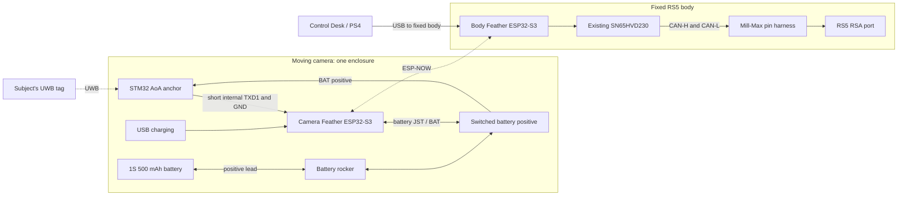

# Wireless camera-to-RS5 connection

Electronics revision, 2026-10-04. One additional **Adafruit Feather ESP32-S3, 8 MB / no PSRAM**, lives with the STM32 anchor on the moving camera. The existing Feather and CAN transceiver stay on the fixed RS5 body. A **single-cell 3.7 V / 500 mAh LiPo**, connected to and charged by the camera Feather through an inline positive-lead rocker, powers both camera-side boards. No power, UART or ground wire crosses a moving gimbal joint.

**Working baseline:** the user confirmed on 2026-10-04 that `anchor → ESP32 → Waveshare → Mill-Max harness → RS5` successfully tracked the tag. This revision implements the camera-ESP32 → body-ESP32 radio hop while retaining that CAN interface. Physical wireless following and the combined camera-side power system remain unverified. [Flash each ESP32 and pair them](../README.md#flash-both-esp32s).

The camera Feather relays measurements using encrypted, paired ESP-NOW. The body Feather calculates bearing and runs the existing pan controller. Keeping tag ID, ranging sequence and distance alongside X/Y coordinates preserves the existing validity checks. This is the tag's bearing relative to the camera, not an absolute gimbal joint angle. The stock anchor/tag firmware and bindings remain in place.

**The body Feather is the master; the camera Feather is an optional measurement peripheral.** The master initiates each request and owns tag selection, tracking and CAN control. The camera only answers with sensor data. Manual mouse/PS4 control works without the camera or a radio pairing. Once paired, camera reports are detected automatically whenever that node is powered and in range. Control Desk offers follow after tag selection and a fresh fix; detecting or reconnecting a camera never starts motion or interrupts an active manual gesture. UWB loss stops active follow and requires a fresh operator action after reacquisition.



ESP-NOW uses the two ESP32s directly without a router. Both use the same fixed 2.4 GHz channel. The subject-to-anchor UWB link continues separately. [Espressif ESP-NOW documentation](https://docs.espressif.com/projects/esp-idf/en/stable/esp32s3/api-reference/network/esp_now.html).

## Camera-side power: direct battery switch

The user selected a **mechanical switch directly in the battery's positive lead**. Put the rocker **before the Feather battery JST**, and connect the STM32 battery input to the Feather's BAT/GND pads. Both boards are downstream of the switch. The Feather's BAT pad is directly connected to its battery JST positive; it is also the charging node. Leave **Feather EN externally unconnected**, using its existing pull-up. No separate load-switch board is needed. [Adafruit power management](https://learn.adafruit.com/adafruit-esp32-s3-feather/power-management).

```text
500 mAh protected 1S LiPo

Battery + ---- rocker ---- Feather battery JST +
                               |
                         Feather BAT pad ---- anchor BAT positive

Battery - ---------------- Feather battery JST -
                               |
                         Feather GND -------- anchor BAT negative / GND

USB-C charging cable ---- camera Feather USB-C
Feather EN: leave externally unconnected

Anchor TXD1 / PA9 -------- camera Feather RX / GPIO38 (115200, 3.3 V UART)
Camera Feather TX / GPIO39: leave unconnected
```

Use a matching **battery extension/pigtail harness**, with the rocker inserted into its positive wire. Remove any previous EN/GND switch wiring first: **neither rocker terminal connects to GND** in this arrangement. The battery must reach the Feather JST only through this switched harness; a second direct connection would bypass the switch. The negative wire stays continuous. Use a separate two-wire pigtail from Feather BAT/GND to the STM32's battery socket. Verify both connector polarities from the actual boards, not from wire colors or connector shells. Assemble the harness with the cell unplugged, and insulate both rocker terminals and solder joints.

**Contacts closed = ON; contacts open = battery OFF.** The rocker now carries the combined battery current and the charging current, so verify its DC rating and the harness against the measured running/startup load. With USB disconnected, OFF removes battery power from both camera-side boards. With Feather USB connected, OFF disconnects the cell but does **not** guarantee either board is off: USB powers the Feather, and the charger's BAT output remains connected to the STM32 branch. Do not operate the complete node as a batteryless USB supply or use this rocker as a USB power cutoff.

Keep the two boards' 3.3 V and USB/5 V rails separate. The anchor uses its own regulator from BAT. Anchor TXD1 is J2 pin 4 and GND is J2 pin 2 in the V1.1 schematic; confirm the board revision/silkscreen. The anchor's CH340 already drives RXD1, so do not connect Feather TX. No camera-side ground wire runs to the fixed body.

The measured PKCELL LP503035 is 35.5 × 29 × 4.65 mm. Confirm pack protection, polarity and discharge rating on the actual cell; connector shells do not establish polarity. Use a protected 1S cell or suitable protection circuit. **500 mAh is capacity, not a discharge-current rating.** The linked PKCELL specification separately lists **500 mA maximum continuous discharge**; verify that the combined radio/anchor load and its transients stay within the actual pack limits.

### Charging and USB servicing

**The rocker must be ON to charge through the Feather USB-C.** OFF opens the cell's positive connection, so the Feather cannot charge it. Charging current flows from Feather BAT back through the closed rocker to the cell. This arrangement keeps the selected two-terminal rocker and adds no switching electronics; it does not provide charging with both boards switched off.

The reviewed Feather schematic uses MCP73831T-2ACI/OT with R4 = 5.1 kΩ: approximately **196 mA (about 0.4 C)** for a 500 mAh cell, with a 4.2 V charge target. This is below the existing cell specification's 500 mA charge maximum; verify the delivered Feather and cell match these specifications. [Adafruit schematic](https://github.com/adafruit/Adafruit-Feather-ESP32-S3-PCB/blob/main/Adafruit%20ESP32-S3%208MB%20No%20PSRAM.sch), [Microchip charger datasheet](https://www.microchip.com/content/dam/mchp/documents/APID/ProductDocuments/DataSheets/MCP73831-Family-Data-Sheet-DS20001984H.pdf), [PKCELL specification](https://www.batterypkcell.com/uploads/LP503035-500mAh-3.7V.pdf).

With USB connected, the Feather normally powers itself from USB, but the STM32 still draws from BAT. Its load subtracts from the available battery-charging current and can prevent proper end-of-charge detection. If its average load reaches the charger current, the cell may not gain charge; peaks can still come from the cell. **Charging the complete assembled node is not yet validated.** Measure net cell current and termination with the real anchor; the CHG LED alone does not establish a complete charge.

For an initial charge/termination check without the anchor load, disconnect USB and battery power, unplug the anchor's BAT pigtail **and UART lead**, then reconnect the cell through the harness, turn the rocker ON and charge through the Feather USB-C. The disconnected UART prevents an unintended signal-pin power path. Unplug USB and switch OFF before reconnecting the anchor. Full charging without opening the enclosure remains dependent on the loaded-charge measurements; the direct switch alone does not solve that limitation.

**Keep both anchor USB ports disconnected in the assembled system.** Its stock TP4056 charger is not the charger for this pack. The original V1.1 schematic programs roughly 1 A, and anchor USB could feed the shared battery rail. For anchor USB configuration, unplug its BAT pigtail and UART before powering it independently; remove its USB before reconnecting them. Do not tie the USB supply rails together or energize both charging circuits. The enclosure exposes Feather USB-C and covers the anchor USB ports. Disconnect all USB cables and unplug the battery before internal soldering or service; the battery-side rocker terminal is live even when OFF.

### Switch opening

The [anchor case revision G](../design/mauwb-anchor/README.md) adds an exact **13.5 mm wide × 8.4 mm high** rectangle in the USB-end short wall (x=0 in exported case coordinates). For the measured **13.27 × 8.18 mm** body this is **0.23 × 0.22 mm total clearance**, with **zero additional fit allowance**. User-reported depth including terminals is approximately **15 mm**. A 20 mm inward corridor reserves room for the body and lead routing; it does not enlarge the aperture. Revision G adds the Feather beneath the STM32, independent board retention, and a 12 × 7 mm Feather USB-C opening. The switch center rises to z=34.1 mm to clear the upper board and its screws. The rocker now switches battery positive directly; the measured opening and board mounts remain the revision-G geometry.

### Runtime

Runtime needs a measurement of **both boards together at the battery**, with actual UWB ranging and ESP-NOW active. Illustrative calculations allowing 80% usable capacity:

| Measured average load | Estimated runtime: 500 mAh × 0.8 ÷ load |
| --- | --- |
| 200 mA | 2.0 hours |
| 300 mA | 1.3 hours |
| 400 mA | 1.0 hour |

These are scenarios, not measured current or promised runtime. Verify stable operation down to the usable battery cutoff; battery voltage sag, regulator dropout, temperature and pack condition affect the result.

## Fixed body wiring

Keep the existing GPIO5 → CAN TX, GPIO6 ← CAN RX, Feather 3V → transceiver supply, common body-side ground, and verified CAN-H/L, termination and detect-resistor arrangement. Remove the old anchor-to-body UART and ground wires. Body RX/GPIO38 and TX/GPIO39 are unused by the wireless build.

The body Feather still needs its **own power**, initially the existing USB connection to Control Desk. RS5 accessory VCC remains insulated. A fixed-body supply/USB lead does not cross the moving axes. The single 500 mAh cell powers only the two camera-side boards; the subject tag retains its own battery.

## Firmware and pairing

| Board | Sketch | Role |
| --- | --- | --- |
| Camera Feather | `firmware/rs5_anchor_radio` | Read the local UART, answer measurement requests; runs on battery without a USB host. |
| Body Feather | `firmware/rs5_wireless_control` | Existing Control Desk/manual/follow/CAN controller with ESP-NOW input instead of UART. |
| STM32 anchor and subject tag | Existing factory firmware | No STM32 flashing needed. |

The original `rs5_manual_control` sketch remains the wired option. The wireless body sketch includes the same controller implementation. Protocol 2, tag selection, X-to-toggle follow, manual control and browser/USB leases remain the same. **This is not autonomous follow on power-up:** the body still needs the existing active Control Desk session, and boots disarmed.

Follow the [main README's flashing guide](../README.md#flash-both-esp32s) for separate camera/body compile and upload commands, Arduino IDE settings, MAC discovery, configuration generation and USB recovery. First-time setup requires a discovery upload to each board, followed by a configured rebuild/upload to **both**. No hardware was flashed for this wireless revision.

The pairing tool writes ignored `firmware/shared/WirelessConfig.h` with both STA MAC addresses, random encryption keys and a fixed channel (default 6; optional `--channel 1` through `11`). It refuses to overwrite an existing pair and never prints keys. Retain that file for future updates to the same boards. Each node verifies its configured MAC against its actual STA MAC.

Verify `radio_ready=1` on the camera and `"transport":"esp-now"`, `"radio_ready":true` inside the body's JSON `uwb` object. Radio-ready means initialized/configured, not that measurements are live. Configure the intended UWB tag in Control Desk and wait for TAG LIVE before enabling follow. Use the [existing setup and sign-calibration procedure](../control_ui/UWB_SETUP.md#controls-and-first-follow-test).

### Freshness and stop behavior

The body requests a sample every 50 ms. Encrypted unicast restricts communication to the configured peer. Each response echoes the body's boot-session token and request sequence; old sessions, duplicate responses and earlier requests cannot refresh the tracker. Source sample age plus the entire request round trip must be at most 150 ms, and the round trip at most 80 ms. No synchronized clocks are required. Millisecond arithmetic handles timer wrap.

Only complete parsed anchor reports update the camera sample. Repeated ranging sequences do not reset its age. UART overrun, malformed/incomplete frames and main-loop stalls invalidate continuity; even if valid data immediately follows, the changed source generation forces the body to disarm and reacquire. The Wi-Fi callback only copies a bounded packet; overflow or a body loop stall invalidates the fix. CAN runs in the main loop.

Follow expires at the existing 300 ms measurement age, and may stop sooner on an explicit invalid-source response. Stale browser input, USB loss and stale joint telemetry still stop motion. Recovery requires three fresh selected-tag reports and a fresh operator enable action. Manual control remains available when UWB is unavailable. Zero/release requests use the existing CAN path; a physically broken CAN connection can prevent those requests reaching the gimbal.

## Bench validation and enclosure boundary

Start disarmed with a balanced, supported gimbal. Verify reports on the body while powering the complete camera node only from its shared battery. Check tag loss, camera power-off, radio interruption, source restart and restoration: follow must stop and never restart by itself. Then test a small tag offset at 5°/s and confirm the camera turns toward it. Verify OFF disables both boards with camera USB disconnected. With the rocker ON, measure net charging current and termination through Feather USB, first with the anchor disconnected and then with its load present. Confirm OFF disconnects the cell from charging, USB can still energize the circuit, and anchor USB remains isolated. Measure current, voltage sag and run time, and verify radio reception throughout gimbal travel with both radios in their intended positions.

**Revision G stacks the Feather under the STM32/antenna**, with two rear M2 screws per board, front locating pins for the Feather and front-edge keepers for the STM32. The user confirmed direct wires without pin headers. Feather USB-C has its own rear-wall opening; the exact rocker aperture and 26.48 mm cage-hole spacing are retained. Body height is 41.1 mm and total height 72.81 mm. The former UART exit remains closed. The inline battery-switch harness replaces the previously planned electronic load switch; verify terminal insulation, lead slack and actual harness fit. Switch flange/clip shape, actual board/component fit, installed wiring and enclosed radio performance still need physical validation; the Feather antenna sits below the STM32 PCB.

Validation on 2026-10-04: both wireless sketches compile with Arduino-ESP32 3.3.11 for `adafruit_feather_esp32s3_nopsram`, both without configuration (MAC discovery) and with a synthetic pairing configuration (encrypted-peer code). The configured camera build uses **933,297 bytes flash / 77,360 bytes static RAM**; the configured body build uses **935,573 / 81,440 bytes**. Only the pre-existing Arduino/core macro whitespace warnings appeared. The synthetic configuration was removed from the source tree after the build; it is not a real hardware pairing. Eight C++ test executables pass with address/undefined-behavior sanitizers, including the actual camera and body sketches, plus all **30 Python UI/bridge tests** and both Node frontend/input suites. Hardware pairing, combined-battery operation, RF reliability and physical following have not been validated for this revision.

Follow-up master/peripheral checks on 2026-10-04: both discovery sketches compiled again with the same board/core profile. Eight sanitized C++ executables passed; the expanded body test covers manual operation with no initialized radio or camera, camera arrival/loss during manual motion, and explicit follow after reacquisition. All **31 Python tests** and both Node suites passed, including optional-camera behavior in the bridge and actual frontend. Control Desk now distinguishes NO UWB, TAG DETECTED and TAG LIVE. These remain software checks; neither ESP32 was flashed during this follow-up.

Host checks (from repository root):

```sh
set -e
mkdir -p tmp
for test in wireless_protocol wireless_transport anchor_radio uwb_transport manual_transport manual_control tracker console_queue; do
  c++ -std=c++17 -Wall -Wextra -Werror -fsanitize=address,undefined \
    -fno-omit-frame-pointer -Ifirmware/tests/manual_stubs \
    "firmware/tests/${test}_test.cpp" -o "tmp/${test}_test"
  "tmp/${test}_test"
done
```
